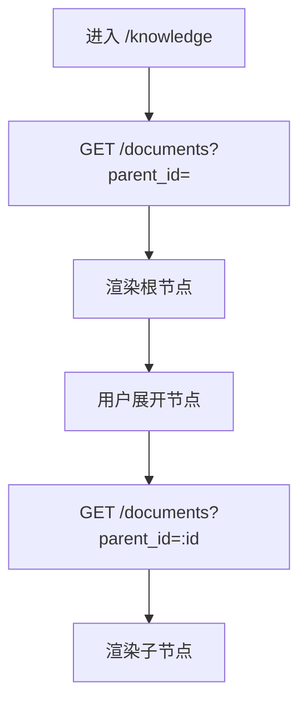
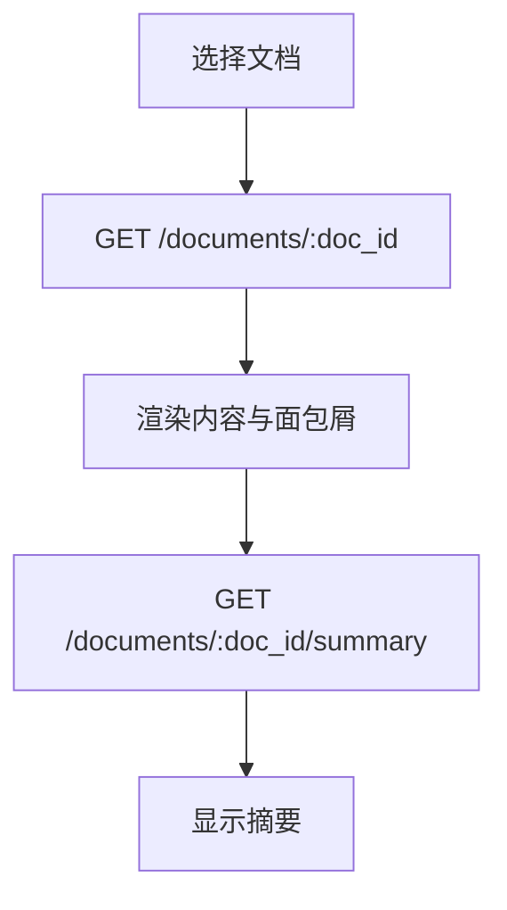
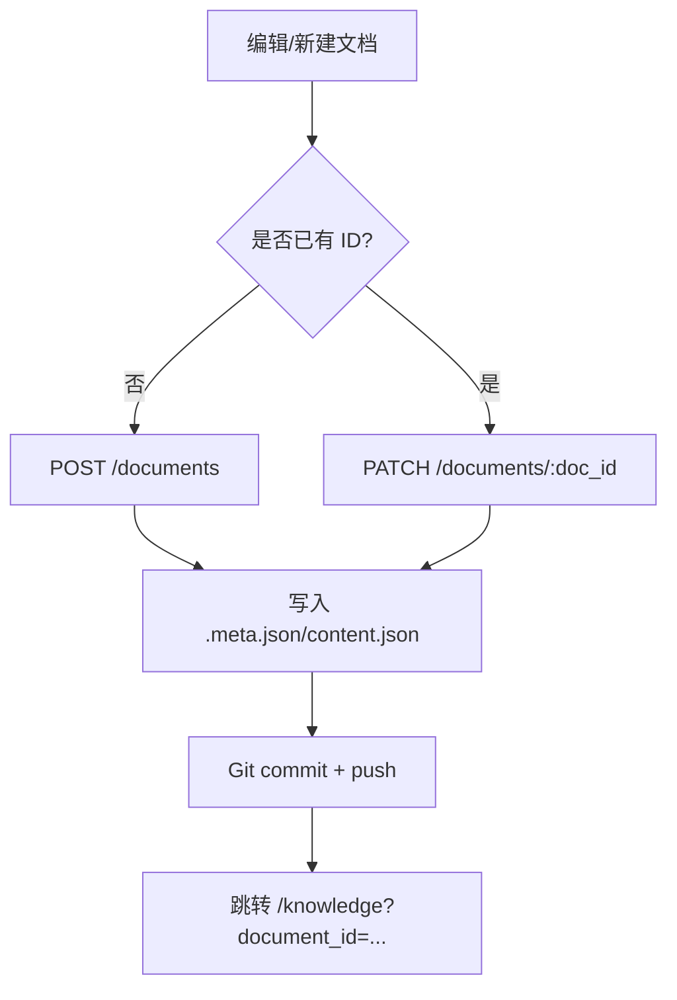
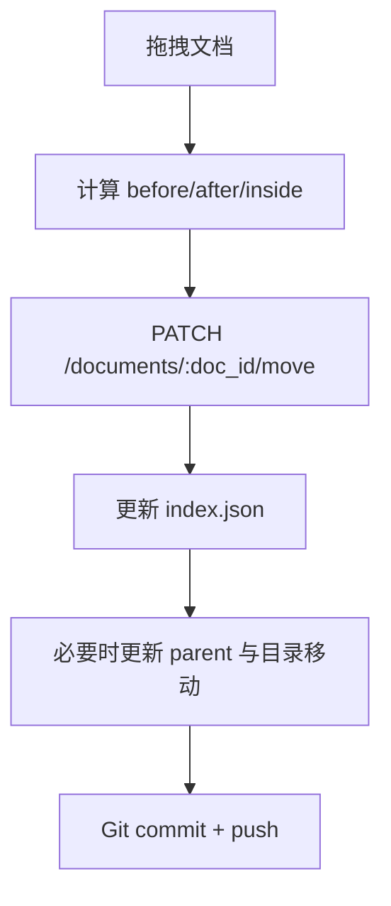
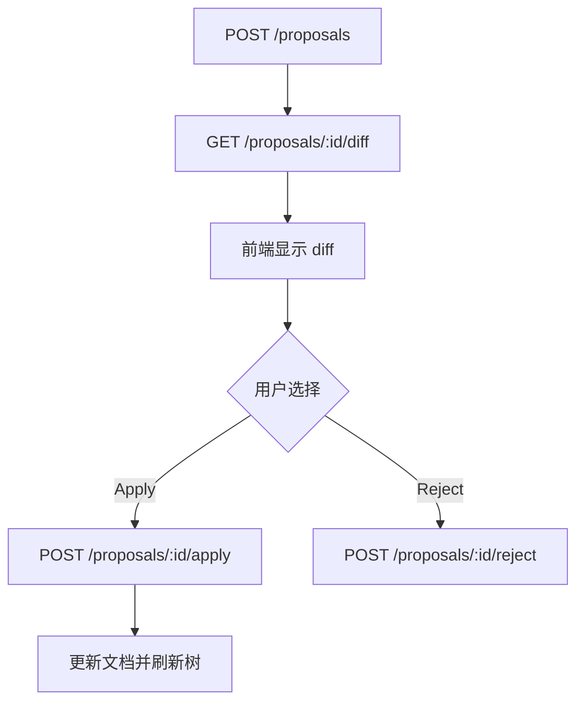
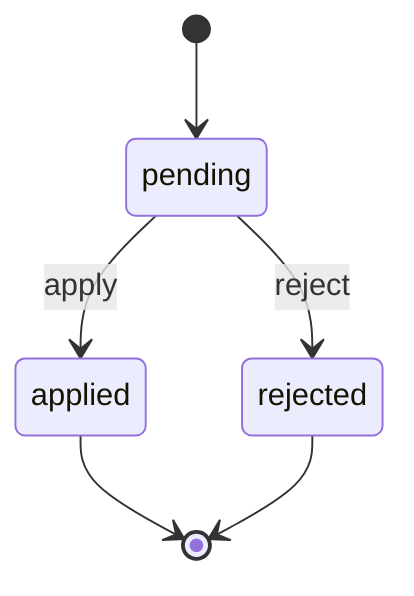

# 知识库功能说明

## 背景与范围

知识库模块用于管理项目的结构化文档，提供文档树浏览、详情查看、编辑保存、拖拽排序、导入 OpenAPI 资料、变更提案等能力。后端以 Git 仓库存储为核心，前端提供树形导航与文档工作台。本说明覆盖前端功能细节、后端接口与存储逻辑。

## 功能概览

- 树形导航：按父子关系与排序加载文档结构，支持展开/折叠与拖拽排序。
- 文档详情：加载文档内容、层级面包屑与摘要信息。
- 文档编辑：新建/编辑文档，支持富文本、JSON 模式与差异对比。
- 变更提案：生成变更提案、预览 diff、应用或驳回。
- OpenAPI 导入：上传文件/文件夹后自动识别并生成 OpenAPI 文档。
- 知识重建：支持对文档或项目触发 RAG 重建（可选生成摘要）。

## 数据与存储结构

### Git 仓库结构

知识库基于项目 Git 仓库存放，根目录下 `docs/` 为文档目录。每个文档是一个独立目录：

```
repo/
  docs/
    index.json
    overview/
      .meta.json
      content.json
    api/
      .meta.json
      content.json
      index.json
      users/
        .meta.json
        content.json
```

- `docs/<slug>/`：文档目录（支持嵌套）。
- `.meta.json`：文档元数据。
- `content.json`：文档内容（Tiptap JSON 或包含 meta/content 的结构）。
- `index.json`：同级文档排序列表（懒生成）。

### 文档元数据（.meta.json）

字段来源：`domain.DocumentMeta`。

- `id`：文档唯一 ID。
- `slug`：目录名，决定路径。
- `title`：标题。
- `parent`：父文档 ID（空或 `root` 表示根节点）。
- `path`：路径（通常为 `/<slug>`）。
- `status`：状态（如 `draft`/`active`）。
- `doc_type`：文档类型，常用值：`document`、`overview`、`spec`、`asset_index`、`openapi`。
- `tags`：标签数组。
- `created_at` / `updated_at`：时间戳。

### 文档内容（content.json）

- 支持两种格式：
  - `{"type":"doc", ...}`（Tiptap 原始文档）
  - `{"meta": {...}, "content": {...}}`（带元信息的结构）
- 服务端会自动归一化内容结构，并补充 `created_at`/`updated_at`。

### 排序机制（index.json）

- `index.json` 结构：`{"version": 1, "order": ["id1", "id2"]}`。
- 若某父级未生成 `index.json`，服务端会按创建时间/slug/ID 生成并写入。
- 移动/排序会更新对应父级的 `index.json`，并在必要时更新文档 `parent`。

### Git 提交机制

- 创建/更新/移动文档后，会执行 Git commit 并 push。
- 索引初始化与排序归一化也会触发 commit。
- 读取文档时会 pull 最新内容（可通过上下文标记跳过）。

### 变更提案存储

- 变更提案存储在 Postgres 表 `knowledge_change_proposal`。
- 字段：`id/project_id/doc_id/status/meta/content/created_at/updated_at`。
- `meta` 与 `content` 使用 JSONB 存储，状态为 `pending`/`applied`/`rejected`。

## 后端接口

### 接口清单

| 功能 | 方法 | 路径 |
| --- | --- | --- |
| 文档列表 | GET | `/api/projects/:project_key/documents?parent_id=` |
| 文档详情 | GET | `/api/projects/:project_key/documents/:doc_id` |
| 创建文档 | POST | `/api/projects/:project_key/documents` |
| 更新文档 | PATCH | `/api/projects/:project_key/documents/:doc_id` |
| 移动/排序 | PATCH | `/api/projects/:project_key/documents/:doc_id/move` |
| 创建提案 | POST | `/api/projects/:project_key/documents/:doc_id/proposals` |
| 提案差异 | GET | `/api/projects/:project_key/documents/:doc_id/proposals/:proposal_id/diff` |
| 应用提案 | POST | `/api/projects/:project_key/documents/:doc_id/proposals/:proposal_id/apply` |
| 驳回提案 | POST | `/api/projects/:project_key/documents/:doc_id/proposals/:proposal_id/reject` |
| 获取摘要 | GET | `/api/projects/:project_key/documents/:doc_id/summary` |
| 重建项目知识 | POST | `/api/projects/:project_key/rag/rebuild` |
| 重建文档知识 | POST | `/api/projects/:project_key/rag/rebuild/documents/:doc_id` |
| 资产上传 | POST | `/api/projects/:project_key/assets/import` |
| 资产类型识别 | GET | `/api/projects/:project_key/assets/:asset_id/kind` |

### 1) 文档列表

**请求**

- `parent_id`：父文档 ID，空或 `root` 表示根级。

**响应示例**

```json
{
  "code": "OK",
  "message": "success",
  "data": [
    {
      "id": "doc-001",
      "slug": "overview",
      "title": "项目概览",
      "parent": "root",
      "path": "/overview",
      "status": "active",
      "doc_type": "overview",
      "has_child": true,
      "tags": [],
      "created_at": "2024-01-01T12:00:00Z",
      "updated_at": "2024-01-02T12:00:00Z"
    }
  ]
}
```

### 2) 文档详情

**响应示例**

```json
{
  "code": "OK",
  "message": "success",
  "data": {
    "meta": {
      "id": "doc-001",
      "slug": "overview",
      "title": "项目概览",
      "parent": "root",
      "path": "/overview",
      "status": "active",
      "doc_type": "overview",
      "tags": [],
      "created_at": "2024-01-01T12:00:00Z",
      "updated_at": "2024-01-02T12:00:00Z"
    },
    "content": {
      "meta": {
        "format": "tiptap",
        "schema_version": 1
      },
      "content": {
        "type": "doc",
        "content": []
      }
    },
    "hierarchy": [
      { "id": "doc-001", "name": "项目概览" }
    ]
  }
}
```

### 3) 创建文档（普通文档）

**请求示例**

```json
{
  "meta": {
    "title": "新建文档",
    "parent": "root",
    "doc_type": "document",
    "status": "draft"
  },
  "content": {
    "meta": {
      "format": "tiptap",
      "schema_version": 1
    },
    "content": {
      "type": "doc",
      "content": []
    }
  }
}
```

**响应示例**

```json
{
  "code": "OK",
  "message": "success",
  "data": {
    "meta": {
      "id": "doc-002",
      "slug": "xin-jian-wen-dang",
      "title": "新建文档",
      "parent": "root",
      "path": "/xin-jian-wen-dang",
      "status": "draft",
      "doc_type": "document",
      "tags": [],
      "created_at": "2024-01-03T10:00:00Z",
      "updated_at": "2024-01-03T10:00:00Z"
    },
    "content": {
      "meta": {
        "format": "tiptap",
        "schema_version": 1
      },
      "content": {
        "type": "doc",
        "content": []
      }
    }
  }
}
```

### 4) 创建文档（OpenAPI 文档）

**请求示例**

```json
{
  "meta": {
    "title": "User Service API",
    "parent": "root",
    "doc_type": "openapi"
  },
  "openapi": {
    "source": "storage://asset-001",
    "renderer": "swagger"
  }
}
```

**响应示例**

```json
{
  "code": "OK",
  "message": "success",
  "data": {
    "meta": {
      "id": "doc-openapi-01",
      "slug": "user-service-api",
      "title": "User Service API",
      "parent": "root",
      "path": "/user-service-api",
      "status": "active",
      "doc_type": "openapi",
      "tags": [],
      "created_at": "2024-01-03T10:00:00Z",
      "updated_at": "2024-01-03T10:00:00Z"
    },
    "content": {
      "meta": {
        "format": "tiptap",
        "schema_version": 1
      },
      "content": {
        "type": "doc",
        "content": [
          {
            "type": "openapi",
            "attrs": {
              "source": "storage://asset-001",
              "renderer": "swagger"
            }
          }
        ]
      }
    }
  }
}
```

### 5) 更新文档

**请求示例**

```json
{
  "meta": {
    "title": "更新标题",
    "status": "active"
  },
  "content": {
    "meta": {
      "format": "tiptap",
      "schema_version": 1
    },
    "content": {
      "type": "doc",
      "content": []
    }
  }
}
```

**响应示例**

```json
{
  "code": "OK",
  "message": "success",
  "data": {
    "meta": {
      "id": "doc-002",
      "slug": "xin-jian-wen-dang",
      "title": "更新标题",
      "parent": "root",
      "path": "/xin-jian-wen-dang",
      "status": "active",
      "doc_type": "document",
      "tags": [],
      "created_at": "2024-01-03T10:00:00Z",
      "updated_at": "2024-01-03T12:00:00Z"
    },
    "content": {
      "meta": {
        "format": "tiptap",
        "schema_version": 1
      },
      "content": {
        "type": "doc",
        "content": []
      }
    }
  }
}
```

### 6) 移动/排序文档

**请求示例**

```json
{
  "new_parent_id": "doc-001",
  "before_id": "doc-003",
  "after_id": "doc-004"
}
```

**响应示例**

```json
{
  "code": "OK",
  "message": "success",
  "data": {
    "id": "doc-002",
    "slug": "xin-jian-wen-dang",
    "title": "更新标题",
    "parent": "doc-001",
    "path": "/xin-jian-wen-dang",
    "status": "active",
    "doc_type": "document",
    "tags": [],
    "created_at": "2024-01-03T10:00:00Z",
    "updated_at": "2024-01-03T12:10:00Z"
  }
}
```

### 7) 创建变更提案

**请求示例**

```json
{
  "meta": {
    "title": "提案标题"
  },
  "content": {
    "meta": {
      "format": "tiptap",
      "schema_version": 1
    },
    "content": {
      "type": "doc",
      "content": []
    }
  }
}
```

**响应示例**

```json
{
  "code": "OK",
  "message": "success",
  "data": {
    "id": "proposal-001",
    "doc_id": "doc-002",
    "status": "pending",
    "created_at": "2024-01-03T13:00:00Z",
    "updated_at": "2024-01-03T13:00:00Z"
  }
}
```

### 8) 获取提案差异

**响应示例**

```json
{
  "code": "OK",
  "message": "success",
  "data": {
    "target_doc_id": "doc-002",
    "base_revision": "a1b2c3d4",
    "meta_diff": "--- meta.json\n+++ proposal.meta.json\n@@\n-  \"title\": \"旧标题\"\n+  \"title\": \"提案标题\"\n",
    "content_diff": "--- content.json\n+++ proposal.content.json\n@@\n-  \"type\": \"doc\"\n+  \"type\": \"doc\"\n"
  }
}
```

### 9) 应用提案

**响应示例**

```json
{
  "code": "OK",
  "message": "success",
  "data": {
    "meta": {
      "id": "doc-002",
      "slug": "xin-jian-wen-dang",
      "title": "提案标题",
      "parent": "root",
      "path": "/xin-jian-wen-dang",
      "status": "active",
      "doc_type": "document",
      "tags": [],
      "created_at": "2024-01-03T10:00:00Z",
      "updated_at": "2024-01-03T13:10:00Z"
    },
    "content": {
      "meta": {
        "format": "tiptap",
        "schema_version": 1
      },
      "content": {
        "type": "doc",
        "content": []
      }
    },
    "hierarchy": [
      { "id": "doc-002", "name": "提案标题" }
    ]
  }
}
```

### 10) 驳回提案

**响应示例**

```json
{
  "code": "OK",
  "message": "proposal rejected"
}
```

### 11) 获取文档摘要

**响应示例**

```json
{
  "code": "OK",
  "message": "success",
  "data": {
    "id": "summary-001",
    "project_id": "project-001",
    "doc_id": "doc-002",
    "summary_text": "这是一段摘要内容",
    "content_hash": "sha256:...",
    "model_runtime": "openai:gpt-4.1",
    "created_at": "2024-01-03T13:20:00Z",
    "updated_at": "2024-01-03T13:20:00Z"
  }
}
```

### 12) 重建项目知识

**请求示例**

```json
{
  "with_summary": true
}
```

**响应示例**

```json
{
  "code": "OK",
  "message": "task created",
  "data": {
    "task_id": "task-001",
    "status": "pending"
  }
}
```

### 13) 重建文档知识

**请求**

- 可选 query 参数：`with_summary=true`。

**响应示例**

```json
{
  "code": "OK",
  "message": "rebuild done",
  "report": {
    "doc_id": "doc-002",
    "chunks": 12
  },
  "summary": {
    "id": "summary-001",
    "summary_text": "这是一段摘要内容"
  }
}
```

### 14) 资产上传（用于导入）

**请求**

- `multipart/form-data`，字段：`file`、`filename`、`mime`、`size`。

**响应示例**

```json
{
  "code": "OK",
  "message": "success",
  "data": {
    "asset_id": "asset-001",
    "filename": "openapi.yaml",
    "mime": "application/yaml",
    "size": 10240
  }
}
```

### 15) 资产类型识别

**响应示例**

```json
{
  "code": "OK",
  "message": "success",
  "data": {
    "kind": "openapi",
    "openapi_version": "3.0.0"
  }
}
```

## 前端功能与交互

### 1) 知识库树与文档详情

- 页面入口：`/knowledge`。
- `KnowledgeBasePage` 负责加载根节点与懒加载子节点。
- 展开节点时按 `parent_id` 拉取子文档。
- 选中文档后，`DocumentPage` 请求文档详情与摘要并显示面包屑。

### 2) 文档编辑与保存

- 新建/编辑页面：`/documents/new`，支持富文本编辑器与 JSON 模式。
- 保存时调用创建或更新接口，成功后跳转至 `/knowledge?document_id=...`。
- JSON 模式用于直接编辑 Tiptap 结构。
- Diff 模式展示编辑前后的段落差异。

### 3) 拖拽排序

- 左侧树导航支持拖拽，计算 `before/after/inside` 三种落点。
- 拖拽后发送 `PATCH /documents/:doc_id/move`，后端更新 `index.json` 与 `parent`。

### 4) 导入与 OpenAPI 自动创建

- 支持文件与文件夹导入，上传仅创建资产。
- 上传后识别资产类型：`GET /assets/:id/kind`。
- `kind=openapi` 时自动创建 OpenAPI 文档；否则仅记录资产。
- 文件夹导入会逐个处理文件并聚合结果。

### 5) 变更提案

- 当 URL 带有 `proposal_id` 时加载提案 diff。
- 提案支持“应用”或“关闭”，应用后更新文档并刷新树节点。

### 6) 知识重建

- 文档页支持重建知识库，可选生成摘要。
- 项目级入口在 ProjectSelector 中，可触发全量重建。

## OpenAPI 文档处理说明

- 创建 OpenAPI 文档需要 `doc_type=openapi` 与 `openapi` payload。
- `openapi.source` 支持 `storage://<assetId>`。
- `openapi.renderer` 默认 `swagger`，可覆盖。
- OpenAPI 文档内容由服务端生成 `openapi` 节点，嵌入 Tiptap 文档结构。
- 前端导入时自动识别 OpenAPI 资产并创建文档，无需手动编辑。

## 流程图（Mermaid）

### 文档树加载



### 文档详情加载



### 文档保存



### 拖拽排序



### 导入与 OpenAPI 创建

```mermaid
flowchart TD
  A[选择文件/文件夹] --> B[POST /assets/import]
  B --> C[GET /assets/:id/kind]
  C --> D{kind=openapi?}
  D -->|是| E[POST /documents (openapi)]
  D -->|否| F[仅记录资产]
  E --> G[刷新树节点]
```

### 提案应用流程



### 提案状态机



## 限制与注意事项

- `parent` 为空或 `root` 表示根节点；排序与层级依赖 `index.json`。
- OpenAPI 文档必须提供 `openapi.source`，否则创建失败。
- 更新/移动文档会触发 Git commit + push，请确保仓库可写且已准备好凭据。
- 变更提案仅存储在数据库，必须显式“应用”才会写入 Git。
- 文档摘要可能不存在（返回 404），需通过重建或摘要生成补齐。
- 导入非 OpenAPI 资产当前仅记录资产，后续“由资产生成文档”仍为待实现步骤。
